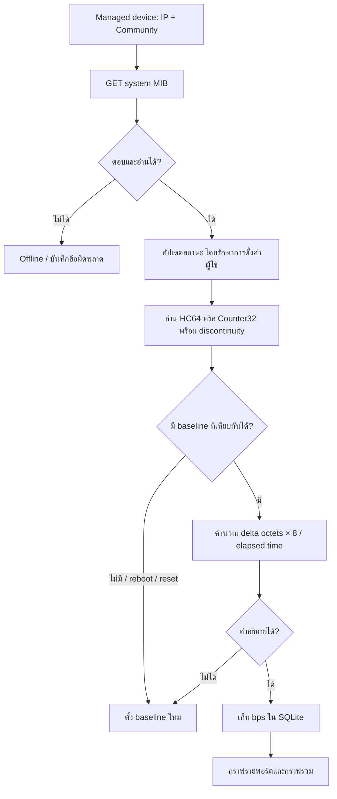
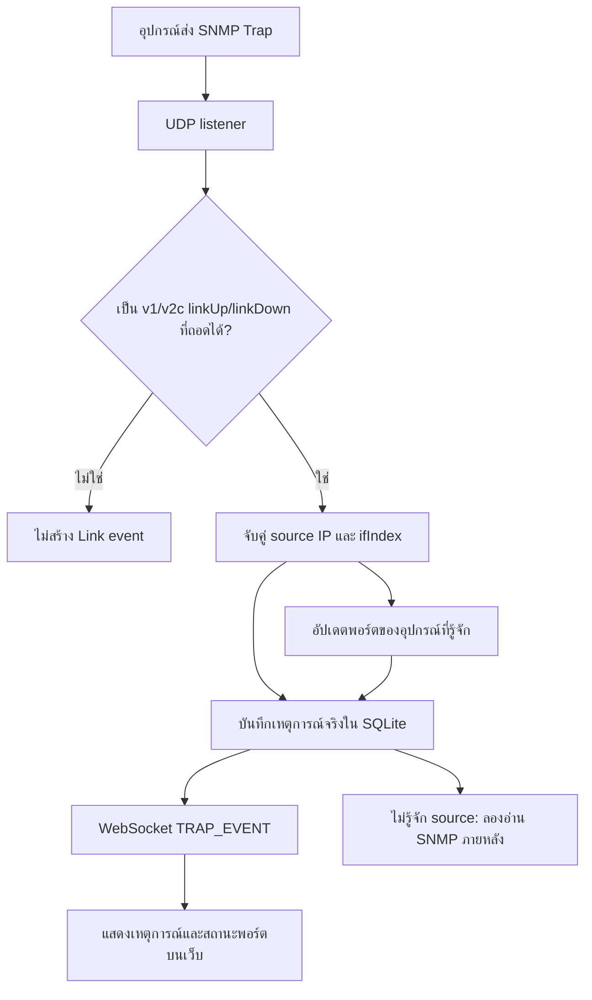
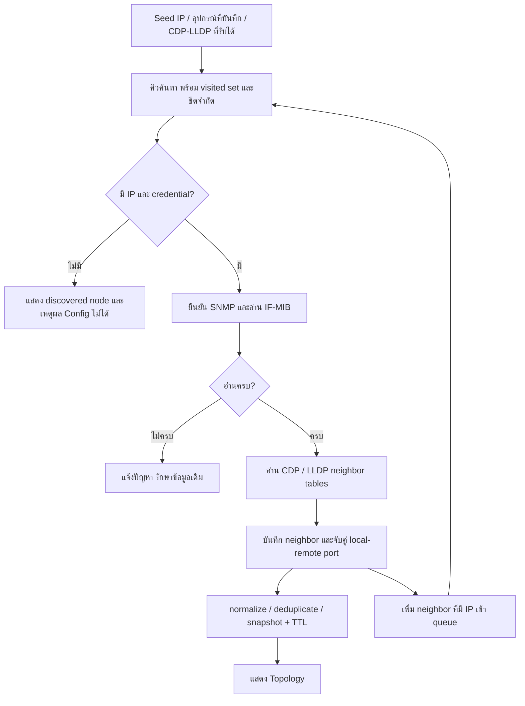

# NetSmonitor — ตรวจและปรับปรุง SNMP, Trap, Discovery

วันที่ตรวจ: 6 ตุลาคม 2026

## สถานะ lab ปัจจุบัน

หลังการตรวจรอบแรก ผู้ใช้ถอดสายจากอุปกรณ์จริง R001/R002 แล้ว ภาพ EVE ที่เปิดอยู่ปัจจุบันมี 4 nodes คือ **Switch, R6, Node4, R2** และเครือข่าย **Net**: R6 Gi0/0 ↔ Node4 e0/2, Node4 e0/1 ↔ R2 Gi0/1, R2 Gi0/0 ↔ Net และ Switch Gi0/0 ↔ Net ตามแผนภาพ EVE เว็บ Monitoring ยังเก็บ R001/R002 เป็น inventory เดิมและแสดง Offline ตามการเชื่อมต่อที่หายไป ไม่มีหลักฐานว่าคู่ R001/R002 เป็นสายของ lab EVE ชุดปัจจุบัน

## ผลตรวจอุปกรณ์จริงในรอบก่อนถอดสาย

| รายการ | ผลที่ตรวจได้ |
|---|---|
| R001 (`192.168.1.1`, Cisco 2911) | SNMP ตอบและอ่าน IF-MIB ได้ขณะต่อสาย |
| SNMP SET ที่ Gi0/1 | ส่งค่า `ifAdminStatus.2 = 1` สำเร็จและอ่านกลับได้ `admin=up`, `oper=down` |
| สถานะก่อนทดสอบ SET | Gi0/1 เปิดอยู่แล้ว การทดสอบยืนยันค่าเดิม ไม่ได้ปิดพอร์ต |
| CDP neighbor | พบ R002 รุ่น Cisco 2901, IP `192.168.3.2` |
| สายจากข้อมูลจริง | **R001 Gi0/2 ↔ R002 GigabitEthernet0/0** |
| อ่าน R002 ผ่าน SNMP | ยังไม่ตอบด้วย Community ที่ระบบมี จึงแสดง node/สาย แต่ปิดการ Config |
| R2/R3 เดิมใน EVE | IP `192.168.8.135` และ `.136` ยังไม่ตอบ SNMP |
| Switch ไม่มี IP | ยังเห็นจาก passive CDP; เป็นรายการแยกจาก R002 |
| Trap receiver | เปิด UDP 162 สำเร็จ |
| ทดสอบ Trap บริการที่รันจริง | ส่ง SNMPv2c จาก localhost → UDP 162 → บันทึก SQLite → รับ `TRAP_EVENT` ผ่าน WebSocket ครบ |

Trap ที่ใช้ตรวจบริการชื่อ `TestInterface` มี Source `127.0.0.1` เป็นแพ็กเก็ตทดสอบจริง ไม่ใช่หลักฐานว่า R001 ตั้งปลายทาง Trap แล้ว ส่วน Trap v1/v2c และการจับคู่พอร์ตจาก IP ขาอื่นทดสอบด้วยแพ็กเก็ตสังเคราะห์ผ่าน UDP และฐานข้อมูลแยก

`admin=up, oper=down` หมายถึงเปิดพอร์ตสำเร็จ แต่ลิงก์ยังไม่ขึ้น ต้องตรวจสายและพอร์ตปลายทางต่อ

## งานที่ทำ

- [x] ตรวจเส้นทาง SNMP GET/WALK/SET, poller, SQLite และการแสดงผล
- [x] ตรวจ decoder Trap, การจับคู่ ifIndex/IP, การบันทึกและส่งเหตุการณ์
- [x] ตรวจ recursive Discovery, การจับคู่พอร์ตและวงจรชีวิตสาย
- [x] แก้สาเหตุที่พบ พร้อม regression tests
- [x] ทดสอบ API/UDP/WebSocket ที่รันจริง และ SNMP บน R001
- [x] ทดสอบรวมและ build หน้าเว็บ
- [ ] ทดสอบ SNMP บน R002 หลังตั้งค่า Community/ACL และเส้นทางไปกลับให้เข้าถึงได้
- [ ] ยืนยัน Trap จาก Router จริงหลังตั้ง destination และเกิด link change จริง

สองข้อท้ายเป็นเงื่อนไขของเครือข่ายจริงที่ยังไม่ได้ยืนยัน ไม่ใช่ผลผ่านของการทดสอบ localhost

## ปัญหาและสิ่งที่แก้

| ส่วน | ปัญหาเดิม | พฤติกรรมหลังแก้ |
|---|---|---|
| การตั้งค่า SNMP | poller บันทึกข้อมูลอุปกรณ์ทั้งชุด อาจเขียน Community เก่าทับค่าที่ผู้ใช้เพิ่งแก้ | อัปเดตเฉพาะ telemetry และตรวจว่าการตั้งค่าการเชื่อมต่อยังตรงกับตอนเริ่มอ่าน |
| Discovery credentials | ค้นด้วย RO สำเร็จแล้วอาจแทนค่า RW ที่บันทึกไว้ | เก็บ credential ของ managed device ไว้; ข้ามผลที่อ่านด้วยค่าก่อนผู้ใช้แก้ |
| แบบฟอร์มแก้ไข | object อุปกรณ์เปลี่ยนทุกครั้งที่ refresh ทำให้ draft ถูกรีเซ็ต | เริ่ม draft ใหม่เฉพาะเปลี่ยนอุปกรณ์หรือเปิด/ปิด dialog |
| SNMP GET | `noSuchObject` อาจถูกมองว่าเชื่อมต่อและอ่าน system ได้ | ไม่มี system OID ที่อ่านได้จะคืน error |
| SNMP version / UDP port | รับ version ที่ engine ไม่รองรับ และ port นอกช่วง | API ยอมรับ v2c สำหรับ monitoring และ port 1–65535 เท่านั้น |
| IF-MIB | ผล WALK บางส่วนอาจแทนรายการพอร์ตทั้งหมด | แยก snapshot ที่อ่านไม่ครบ ไม่ใช้แทน inventory |
| ความเร็วพอร์ต | `ifSpeed` จำกัดช่วง 32 บิต; เดาความเร็วเริ่มต้น | อ่าน `ifHighSpeed`; ไม่สมมติ 1 Gbps เมื่อไม่มีค่า |
| IP ของ interface | ไม่อ่าน IP ขาอื่นของ Router | อ่าน IPv4 IP-MIB เพื่อช่วยจับคู่ source ของ Trap |
| Counter | เดาจากขนาดตัวเลขว่าเป็น counter 32 บิต | เก็บ width ของแต่ละ counter และ fallback จาก HC ไป 32 บิต |
| อุปกรณ์ reboot/reset | counter ลดอาจสร้าง traffic spike | ใช้ sysUpTime และ ifCounterDiscontinuityTime รีเซ็ต baseline |
| ค่าทราฟฟิกผิดปกติ | cap ค่าผิดให้กลายเป็นยอดสูงเทียม | ข้าม sample ที่อธิบายไม่ได้ด้วย counter/ความเร็วที่อ่านได้ |
| Counter32 หลายรอบ | อาจรายงานอัตราต่ำผิดเพราะ counter วนหลายครั้ง | ไม่คำนวณช่วงที่อาจวนหลายครั้งตาม line rate; ควรใช้ HC64 หรืออ่านถี่ขึ้น |
| Virtual interface | ไม่อ่าน traffic ทั้งที่เลือกดูได้ | poll counters ของทุก interface ที่ SNMP รายงาน |
| กราฟรวม | SUM ตัวอย่าง bps ของพอร์ตเดิมซ้ำใน bucket | AVG แต่ละพอร์ตใน bucket แล้ว SUM ข้ามพอร์ต |
| Trap v1 | ไม่แยก varbind ของ interface | อ่าน ifIndex, description และ admin/oper ทั้ง v1 และ v2c |
| Trap ไม่มี ifIndex varbind | จับคู่พอร์ตไม่ได้ | ใช้ index ใน suffix ของ ifAdminStatus/ifOperStatus/ifDescr/ifName |
| Source Trap | match เฉพาะ Management IP | match IP ของ interface ที่อ่านได้ด้วย |
| Trap จากเครื่องไม่รู้จัก | รอ SNMP enrollment ก่อนบันทึกเหตุการณ์ | บันทึกและ broadcast ก่อน แล้วจำกัดเวลาลอง enrollment |
| Lifecycle Trap | task ไม่ถูกติดตามและแจ้งพอร์ต 162 เสมอ | จำกัด task, เก็บข้อผิดพลาด, ยกเลิกตอนปิดและ log พอร์ตที่ bind จริง |
| WebSocket | หลุดแล้วไม่ reconnect | reconnect แบบเพิ่มระยะรอ และดึง events ที่พลาดจากฐานข้อมูล |
| สายซ้ำใน snapshot | unique constraint อาจทำให้ Discovery ล้ม | รองรับข้อมูลสายซ้ำหลัง normalize ชื่อพอร์ต |
| Neighbor ข้อมูลพอร์ตไม่ครบ | อาจมองเป็น snapshot ว่างแล้วลบสาย | เก็บ node, แจ้งข้อมูลพอร์ตไม่ครบ และไม่แทน snapshot เดิม |
| ประเภท Cisco Router | capability Switch ทำให้ Cisco 2901 กลายเป็น Switch | ตรวจ platform ก่อน capability; ใช้ร่วมกันทั้ง passive/active discovery |
| แผนภาพเมื่อมี node คั่นกลาง | เส้นของ R001 ↔ R002 พาดผ่าน R2/R3 จึงดูเหมือนเชื่อมผิดตัว | เลี่ยง node ที่อยู่กลางทางและวางชื่อพอร์ตบนทางเดินสายที่ไม่ชน node |
| ข้อความผิดพลาด | Test Connection เหมารวมทุกอย่างเป็น timeout | แสดงเหตุผลจาก SNMP และพอร์ตที่ใช้งานจริง |

## การทำงาน SNMP

การเปิด/ปิดพอร์ตใช้ SNMP SET `ifAdminStatus.<ifIndex>` ค่า 1 หรือ 2 แล้ว GET อ่านกลับ ต้องมีสิทธิ์เขียน OID นี้ การทดสอบ GET สำเร็จยืนยันได้เฉพาะสิทธิ์อ่าน ไม่สามารถยืนยัน RW ได้

## การทำงาน Trap

Polling และ SET ไม่สร้าง Link Trap event ปลอม เหตุการณ์ Link ใน event log มาจากแพ็กเก็ตที่ receiver รับเท่านั้น ตัวเลือกทดสอบส่งแพ็กเก็ตผ่าน UDP จริงและติดชื่อ TestInterface

## การทำงาน Discovery

Subnet เป็นตัวเลือกเสริม การอยู่ subnet เดียวกันไม่ใช่หลักฐานว่าสายต่อกัน โปรแกรมไม่ได้อ่าน topology ผ่าน EVE API

## ผลทดสอบ

| ชุดทดสอบ | ผล |
|---|---|
| `python -m unittest discover -s tests -q` ใน `.venv` | 90 tests ผ่าน |
| `npm run test:discovery` | 20 tests ผ่าน |
| `npm run build` | ผ่าน TypeScript และ Vite production build |
| SNMP SET / readback R001 Gi0/1 | ผ่าน: admin up / oper down |
| Discovery จริงจาก R001 ก่อนถอดสาย | พบ R002 และสายตามพอร์ตจริง |
| บริการ Trap + SQLite + WebSocket ที่รันจริง | ผ่าน ด้วย localhost TestInterface |

การทดสอบอัตโนมัติครอบคลุมวงจร 3 nodes, neighbor ไม่มี IP, identity/สายซ้ำ, TTL/ย้ายสาย, timeout, SNMP SET ถูกปฏิเสธ/อ่านกลับไม่ตรง, credentials เปลี่ยนระหว่างอ่าน, counter reboot/wrap และ UDP Trap v1/v2c

ชุดทดสอบหน้าเว็บเดิมบางข้อยังอ้าง markup ก่อน Redesign จึงปรับตัวโหลด CSS/รูปและ assertions ให้ตรวจพฤติกรรมของหน้าปัจจุบัน รวมถึงเพิ่มกรณี reconnect/cleanup ของ WebSocket

## สิ่งที่ต้องเตรียมบนอุปกรณ์

1. เปิด interface ที่ต่อสายและ CDP/LLDP บนลิงก์ทั้งสองฝั่ง
2. อุปกรณ์เริ่มต้นและอุปกรณ์ที่ต้องค้นต่อผ่าน SNMP ต้องมี IP ที่เครื่อง Monitor ไปถึง มีเส้นทางตอบกลับ และ Community/ACL ที่ยอมให้อ่าน MIB
3. การสั่งพอร์ตต้องมี RW/SNMP View ที่อนุญาต `ifAdminStatus` โดยค่าที่บันทึกในโปรแกรมต้องตรงกับอุปกรณ์
4. Trap ต้องตั้ง destination เป็น IP ของเครื่อง Monitor ที่ Router เข้าถึงได้ และอนุญาต UDP 162 ที่เครื่องรับ หาก listener ใช้ 1162 ต้องกำหนดปลายทางหรือ redirect ให้ตรง
5. สำหรับ R001 เครื่อง Monitor มี Ethernet IP `192.168.1.2` ส่วน R002 ประกาศ IP `192.168.3.2`; ต้องตรวจ Community, UDP 161 และเส้นทางไปกลับก่อนจะอ่าน R002 ได้

## ขอบเขตที่ยังมีอยู่

- Monitoring/SET/Discovery ใช้ SNMPv2c; ไม่ได้เพิ่ม SNMPv3 ในงานนี้
- Receiver รองรับ linkUp/linkDown แบบ Trap v1/v2c; ยังไม่ได้เพิ่ม SNMP INFORM acknowledgement หรือ vendor-specific traps ทุกชนิด
- Passive CDP/LLDP เห็นเฉพาะเฟรมที่มาถึง NIC ของเครื่อง Monitor; การค้นต่อหลาย hop อาศัย neighbor table ผ่าน SNMP
- IP mapping ของ Trap ใช้ IPv4 address table ที่อุปกรณ์เปิดให้อ่าน; source ที่ไม่อยู่ใน inventory ยังคงแสดง Unknown source
- Counter32 ที่อ่านห่างเกินไปอาจไม่มีกราฟช่วงนั้น เพื่อไม่แสดงค่าที่คำนวณยืนยันไม่ได้
- กราฟรวมเป็นผลรวมค่าเฉลี่ยพอร์ตต่อ bucket ไม่ใช่ปริมาณ traffic ของ network ที่ตัดการนับข้ามลิงก์ซ้ำแล้ว
- ข้อมูล historical traffic ต้องสะสมตามเวลาจริง; ไม่สามารถสร้างประวัติเดือน/ปีย้อนหลังก่อนเริ่มเก็บ
- ระบบยังใช้ฐานข้อมูลในเครื่องและไม่มี authentication ของเว็บ; การปรับปรุงครั้งนี้ไม่ได้เปลี่ยน deployment architecture

## แหล่งอ้างอิงโปรโตคอล

- [RFC 2863 — IF-MIB, counters, discontinuities และ interface status](https://www.rfc-editor.org/rfc/rfc2863)
- [RFC 1157 — SNMPv1 Trap-PDU](https://www.rfc-editor.org/rfc/rfc1157)
- [Cisco — CDP และการอ่าน neighbor information](https://www.cisco.com/c/en/us/td/docs/ios-xml/ios/cdp/configuration/15-mt/cdp-15-mt-book/nm-cdp-discover.html)
