# NetSmonitor — สรุปการทำงานและ Flowchart

เอกสารประกอบโปรแกรม Monitor อุปกรณ์เครือข่ายด้วย SNMP สำหรับ Assignment 3

- วันที่จัดทำ: 3 ตุลาคม 2026
- อ้างอิงโค้ด: commit `a287997` และไฟล์ในโปรเจกต์ ณ วันที่จัดทำ
- ขอบเขต: สรุปจากการอ่านโค้ดปัจจุบัน ไม่ใช่ผลทดสอบการเชื่อมต่อ lab รอบใหม่
- แผนภาพใช้ Mermaid เปิดดูได้บน GitHub หรือโปรแกรมอ่าน Markdown ที่รองรับ Mermaid

## สารบัญ

1. [ภาพรวมโปรแกรม](#1-ภาพรวมโปรแกรม)
2. [สถาปัตยกรรมและการเชื่อมต่อ](#2-สถาปัตยกรรมและการเชื่อมต่อ)
3. [การเริ่มต้นระบบ](#3-การเริ่มต้นระบบ)
4. [หน้าจอและการใช้งาน](#4-หน้าจอและการใช้งาน)
5. [การเพิ่มและแก้ไขอุปกรณ์](#5-การเพิ่มและแก้ไขอุปกรณ์)
6. [การอ่านข้อมูลและกราฟ Traffic](#6-การอ่านข้อมูลและกราฟ-traffic)
7. [การสั่งเปิดและปิด Interface](#7-การสั่งเปิดและปิด-interface)
8. [การรับ SNMP Trap](#8-การรับ-snmp-trap)
9. [Auto Discovery ด้วย CDP และ LLDP](#9-auto-discovery-ด้วย-cdp-และ-lldp)
10. [การสร้าง Topology และลดสายซ้ำ](#10-การสร้าง-topology-และลดสายซ้ำ)
11. [การตั้งค่ารอบอ่านข้อมูล](#11-การตั้งค่ารอบอ่านข้อมูล)
12. [ฟังก์ชันและโมดูลสำคัญ](#12-ฟังก์ชันและโมดูลสำคัญ)
13. [API และข้อความ Real-time](#13-api-และข้อความ-real-time)
14. [การจัดเก็บข้อมูล](#14-การจัดเก็บข้อมูล)
15. [ความครอบคลุม Requirement](#15-ความครอบคลุม-requirement)
16. [ข้อจำกัดและจุดที่ควรพัฒนาต่อ](#16-ข้อจำกัดและจุดที่ควรพัฒนาต่อ)
17. [การเปิดโปรแกรมและเอกสารที่เกี่ยวข้อง](#17-การเปิดโปรแกรมและเอกสารที่เกี่ยวข้อง)

## 1. ภาพรวมโปรแกรม

**NetSmonitor** เป็นเว็บแอปสำหรับตรวจสอบ Router และ Switch โดยเชื่อมต่อ Management IP ของอุปกรณ์ผ่าน SNMP เพื่ออ่านข้อมูลอุปกรณ์ รายการ Interface และตัวนับ Traffic รวมถึงสั่งเปลี่ยนสถานะการเปิดใช้งานพอร์ต

ความสามารถหลักประกอบด้วย:

- แสดงภาพรวมสถานะอุปกรณ์และข้อมูล Traffic ผ่านเว็บ
- เพิ่ม ทดสอบ แก้ไข และลบอุปกรณ์ที่เชื่อมต่อผ่าน IP
- แสดงพอร์ตเป็นภาพ พร้อมชื่อพอร์ตและสถานะ Admin/Oper
- สั่ง Interface Up/Down ด้วย SNMP SET และอ่านค่ากลับเพื่อยืนยัน
- เก็บข้อมูลรับ/ส่งของพอร์ตและแสดงกราฟย้อนหลัง
- รับ `linkUp` / `linkDown` จาก SNMP Trap และส่งเหตุการณ์ให้หน้าเว็บ
- ค้นหา Neighbor ด้วย CDP/LLDP ทั้งจากเฟรมที่เครื่องรับได้และจาก Neighbor MIB ผ่าน SNMP
- สร้าง Topology จากข้อมูล Neighbor และพอร์ตที่รายงาน
- แสดงอุปกรณ์ที่ยังไม่มี IP โดยแจ้งว่าไม่สามารถ Config หรืออ่าน Traffic ผ่าน SNMP ได้
- ปรับรอบอ่านข้อมูลผ่านหน้าต่างตั้งค่าและบันทึกไว้ข้ามการเริ่มระบบใหม่

### หลักการสำคัญ

**การค้นพบอุปกรณ์ ไม่เท่ากับการ Monitor อุปกรณ์ได้ครบ** การพบชื่อจาก CDP/LLDP อาจยังไม่มี IP หรือสิทธิ์ SNMP จึงแสดง Node ได้ แต่ยังอ่านพอร์ตทั้งหมด Traffic หรือสั่ง Up/Down ไม่ได้

ระบบ **ไม่เชื่อมต่อ EVE-NG ผ่าน API** และไม่ดึงรายการ Node/สายจากหน้า EVE อุปกรณ์ใน EVE-NG กับอุปกรณ์จริงใช้หลักการเดียวกัน: เครื่องที่รันบริการต้องเข้าถึง Management IP และ SNMP ของอุปกรณ์ได้

## 2. สถาปัตยกรรมและการเชื่อมต่อ

### 2.1 โครงสร้างโฟลเดอร์

โครงสร้างไฟล์สำคัญของโปรเจกต์ปัจจุบัน (ละไฟล์ย่อยบางส่วนเพื่อให้อ่านง่าย):

```text
NetFix/                              # โฟลเดอร์โปรเจกต์; ชื่อเว็บคือ NetSmonitor
├── run.bat                          # เปิดทั้ง API และเว็บบน Windows พร้อมเปิดเบราว์เซอร์
├── run_backend.py                   # ตัวเริ่มบริการ: เรียก Uvicorn โหลด backend.main:app
├── package.json                     # Dependencies และคำสั่ง npm ของหน้าเว็บ
├── index.html                       # HTML เริ่มต้นของเว็บและ Favicon
├── vite.config.ts                   # ตั้งค่า Vite
├── tsconfig.json                    # ตั้งค่า TypeScript
├── backend/                         # โค้ดบริการ FastAPI และงาน SNMP
│   ├── main.py                      # สร้าง app = FastAPI(...), REST API, WebSocket, lifespan
│   ├── snmp_engine.py               # SNMP GET / WALK / SET
│   ├── poller.py                    # อ่านข้อมูลตามรอบและคำนวณ Traffic
│   ├── trap_receiver.py             # รับและประมวลผล SNMP Trap
│   ├── discovery.py                 # อ่าน CDP/LLDP MIB และค้น Neighbor ต่อ
│   ├── discovery_jobs.py            # จัดการ Discovery Job และรอบค้นอัตโนมัติ
│   ├── network_scanner.py           # ค้นหา IP ที่ตอบ SNMP ภายใน Subnet
│   ├── cdp_receiver.py              # Capture เฟรมและแยก CDP
│   ├── lldp_receiver.py             # แยกเฟรม LLDP
│   ├── database.py                  # SQLite Schema และฟังก์ชันจัดเก็บข้อมูล
│   ├── snmp_monitor.db              # ฐานข้อมูลขณะใช้งาน; ไม่รวมใน Git
│   ├── test_trap_sender.py          # เครื่องมือส่ง Trap ทดสอบ
│   ├── requirements.txt            # Dependencies ของบริการ Python
│   └── requirements-dev.txt        # Dependencies สำหรับพัฒนา/ทดสอบ
├── src/                             # โค้ดหน้าเว็บ React / TypeScript
│   ├── main.tsx                     # สร้าง React Root และโหลด App
│   ├── App.tsx                      # ประกอบหน้าจอและสลับ View
│   ├── context/SnmpContext.tsx      # สถานะส่วนกลางและการเชื่อมต่อข้อมูล
│   ├── components/
│   │   ├── layout/                  # Topbar และ Sidebar
│   │   ├── dashboard/               # ภาพรวม Monitoring
│   │   ├── devices/                 # รายการอุปกรณ์และ Popup เพิ่ม/แก้ไข
│   │   ├── device-detail/           # รายละเอียดอุปกรณ์และภาพพอร์ต
│   │   ├── traffic/                 # หน้ากราฟ Traffic
│   │   ├── events/                  # หน้า Trap Events
│   │   ├── topology/                # Node และสาย Topology
│   │   ├── settings/                # ตั้งค่าและ Audit Log
│   │   └── common/                  # กราฟ Icon Toast และ Popup ยืนยัน
│   ├── services/                    # REST API, WebSocket, Discovery และ Serial
│   ├── hooks/                       # Hook อ่าน Traffic ล่าสุด
│   ├── utils/                       # จับคู่ Device, จัด Topology และคำนวณสถิติ
│   ├── types/                       # Type ของข้อมูลและ Serial
│   ├── assets/                      # Asset ที่นำเข้าในโค้ด เช่น Logo เว็บ
│   ├── data/                        # ข้อมูลประกอบในโค้ด
│   ├── index.css                    # รูปแบบหน้าจอพื้นฐาน
│   └── enterprise.css               # รูปแบบหน้าจอที่ปรับปรุง
├── public/                          # Static Asset ที่ Vite ให้บริการโดยตรง
├── tests/                           # ชุดทดสอบ Python และ Frontend Discovery
├── docs/                            # เอกสารระบบและ Logo
├── dist/                            # ผล Build หน้าเว็บ; สร้างจาก npm run build
├── node_modules/                    # Dependencies หน้าเว็บ; สร้างจาก npm install/ci
├── README.md                        # วิธีใช้งานและเตรียม lab
├── PRD_SNMP_Network_Monitor.md       # Requirement ของระบบ
└── TASKS_*.md                       # เอกสารงาน Discovery / Topology / UI
```

### FastAPI อยู่ตรงไหน และเริ่มรันอย่างไร

ตัวแอป FastAPI ถูกประกาศใน **[backend/main.py](../backend/main.py)** ด้วย `app = FastAPI(...)` ภายในไฟล์เดียวกันมี API Route, WebSocket และ `lifespan()` ที่เริ่มงาน SNMP ไม่ได้มีโฟลเดอร์ชื่อ `fastapi` แยกอยู่ในโปรเจกต์ เพราะ FastAPI เป็น Library ที่ติดตั้งผ่าน `backend/requirements.txt`

ไฟล์ **[run_backend.py](../run_backend.py)** ที่โฟลเดอร์หลักเป็นตัวเรียกใช้งาน โดยเพิ่ม `backend/` ใน Python Import Path แล้วสั่ง:

```python
uvicorn.run("backend.main:app", host="0.0.0.0", port=8000, reload=False)
```

`backend.main:app` หมายถึงโหลดตัวแปร `app` จากไฟล์ `backend/main.py` ส่วน **Uvicorn** เป็น Server ที่รับ HTTP/WebSocket และรันแอป FastAPI

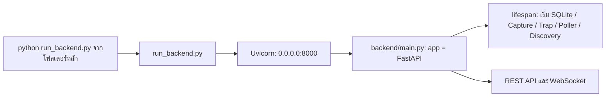

### 2.2 การเชื่อมต่อระหว่างส่วนประกอบ

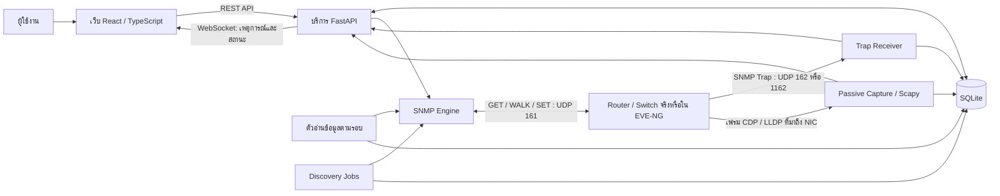

| ส่วนประกอบ | เทคโนโลยี / บทบาท |
| --- | --- |
| หน้าเว็บ | React 18, TypeScript, Vite; จัดการหน้าจอและสถานะผ่าน Context |
| บริการระบบ | FastAPI; REST API, WebSocket และงานเบื้องหลัง |
| SNMP | PySNMP แบบ async; อ่าน System MIB, IF-MIB, CDP-MIB และ LLDP-MIB |
| รับเฟรม Neighbor | Scapy; แยกข้อมูล CDP/LLDP จาก Ethernet frame |
| รับ Trap | UDP Datagram Receiver และ PyASN1 |
| ฐานข้อมูล | SQLite พร้อม WAL และเปิดใช้ Foreign Keys |
| กราฟ / Topology | Canvas สำหรับ Traffic และ SVG สำหรับ Topology |

### 2.3 ช่องทางติดต่อ

| ช่องทาง | ค่าในโค้ดปัจจุบัน |
| --- | --- |
| เว็บระหว่างพัฒนา | `http://localhost:5173/` |
| REST API | `http://localhost:8000/api` |
| WebSocket | `ws://localhost:8000/ws/events` |
| SNMP ไปยังอุปกรณ์ | UDP 161 เป็นค่าเริ่มต้น; อุปกรณ์ที่เพิ่มด้วย IP กำหนดพอร์ตอื่นได้ |
| รับ Trap | UDP 162; พยายามใช้ 1162 หากเปิด 162 ไม่ได้ |
| Passive CDP/LLDP | เฟรม Ethernet บน NIC ที่เลือก ไม่ใช่การสแกน IP |

> ถ้าบริการรับ Trap ใช้ 1162 ต้องตั้งปลายทาง Trap หรือการส่งต่อพอร์ตให้ตรงกับพอร์ตจริง หน้า Settings แสดงพอร์ตที่เปิดรับอยู่

## 3. การเริ่มต้นระบบ

ฟังก์ชัน `lifespan()` ใน [main.py](../backend/main.py) เตรียมฐานข้อมูลและเริ่มงานเบื้องหลัง เมื่อปิดบริการจะหยุด Capture, Discovery, Trap transport และ Poller

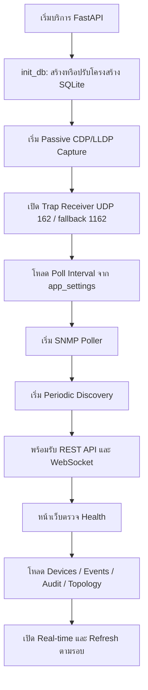

- ค่าเริ่มต้นรอบอ่าน SNMP คือ **60 วินาที** หากยังไม่เคยบันทึกค่า
- Discovery ตามรอบเริ่มตรวจหลังรอช่วงเวลาที่กำหนด และทำงานเมื่อมีอุปกรณ์ที่ยืนยัน SNMP พร้อม Community อยู่แล้ว
- Capture ที่ไม่พร้อมใช้งานจะรายงานสถานะและข้อผิดพลาด เช่น ไม่มี Npcap; งาน SNMP เป็นอีกช่องทางหนึ่ง
- `init_db()` ไม่เรียกเติมอุปกรณ์หรือ Traffic ตัวอย่าง แม้มีฟังก์ชัน `seed_initial_data()` เหลืออยู่ในไฟล์

## 4. หน้าจอและการใช้งาน

| หน้าจอ | สิ่งที่แสดง / การใช้งานหลัก |
| --- | --- |
| Dashboard | ภาพรวมอุปกรณ์ สถานะ Traffic รวม เหตุการณ์ล่าสุด และพอร์ตที่มี Traffic สูง |
| อุปกรณ์ | ค้นหา กรอง และเรียงรายการ; เพิ่มด้วย IP, ทดสอบ SNMP, แก้ไข/ลบ และเปิดเครื่องมือ Discovery |
| รายละเอียดอุปกรณ์ | ข้อมูลอุปกรณ์ ภาพพอร์ต ชื่อพอร์ต สถานะ Admin/Oper; เลือกพอร์ตเพื่อเปิดกราฟหรือเมนูควบคุม |
| Traffic | กราฟ In/Out ของพอร์ต สถิติ Current/Min/Max/Average; เลือกช่วงเวลาและส่งออก CSV/PNG |
| Events | เหตุการณ์ Trap; กรองตามอุปกรณ์/ประเภท เปิดปิดการแสดง Real-time และส่ง Test Trap |
| Topology | Node และสายจาก Neighbor; เริ่ม Discovery ดูความคืบหน้า เลื่อน/ซูม และคลิกอุปกรณ์เพื่อดูพอร์ต |
| Settings | สถานะบริการ รอบอ่าน SNMP ปุ่มตั้งค่าเปิด Popup สถานะ Trap Receiver และ Audit Log |

### Popup และเมนู

- **เพิ่มอุปกรณ์:** Management IP, Community, SNMP port และข้อมูลอุปกรณ์ พร้อมทดสอบการเชื่อมต่อ
- **แก้ไขอุปกรณ์:** บันทึกหลังทดสอบ SNMP และอ่าน Interface ใหม่
- **ยืนยันคำสั่ง:** ใช้ก่อนดำเนินการ เช่น เปลี่ยนสถานะพอร์ตหรือลบอุปกรณ์
- **ตั้งค่ารอบอ่าน:** กรอกจำนวนวินาที ตรวจความถูกต้องและบันทึก; ยกเลิกจะทิ้งค่าที่ยังไม่บันทึก
- **เมนูพอร์ต:** เปิดดู Traffic หรือสั่งเปิด/ปิดพอร์ตตามสถานะและข้อจำกัดของอุปกรณ์

### ความหมายของสถานะ

| สถานะ / Flag | ความหมาย |
| --- | --- |
| `online` | อุปกรณ์ที่ยืนยัน SNMP ตอบการตรวจ System MIB ล่าสุด |
| `offline` | อุปกรณ์ไม่ตอบ SNMP หรือ Neighbor หมดอายุ; จึงไม่ได้แปลว่าปิดเครื่องแน่นอน |
| `discovered` | ยังพบประกาศ CDP/LLDP แต่ยังไม่ได้ยืนยันเป็นอุปกรณ์ที่ Monitor ผ่าน SNMP |
| `discovery_only = true` | มีข้อมูลจาก Neighbor เท่านั้น ปิดความสามารถ Config และการอ่าน Traffic ผ่าน SNMP |
| Admin Up/Down | สถานะอนุญาตให้ Interface ทำงานตาม `ifAdminStatus` |
| Oper Up/Down | สถานะการทำงานจริงตามข้อมูลที่อ่านหรือ Trap ที่ได้รับ |
| `unknown` บนพอร์ต | ทราบชื่อจาก Neighbor แต่ยังไม่ทราบสถานะผ่าน SNMP |

## 5. การเพิ่มและแก้ไขอุปกรณ์

การเพิ่มด้วย IP ต้องได้รับข้อมูลจริงจาก SNMP ก่อนบันทึกเข้า Inventory หลัก ไม่ใช้การตอบ Ping อย่างเดียวเป็นหลักฐาน

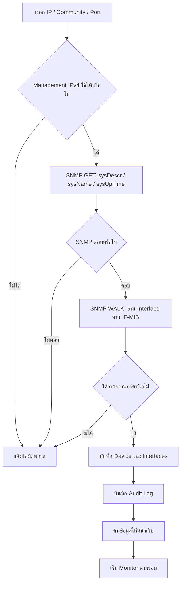

- `test_device_connection()` ทดสอบ System MIB; การเพิ่มจริงยังต้องอ่าน Interface สำเร็จอีกขั้น
- `create_device()` ตรวจ IP ซ้ำและบันทึกข้อมูลพอร์ตที่อ่านได้
- `update_single_device()` ทดสอบ IP/Community ใหม่และอ่านพอร์ตใหม่ก่อนบันทึก
- อุปกรณ์ที่พบผ่าน CDP/LLDP สามารถยืนยันเป็นอุปกรณ์ SNMP ได้ภายหลัง เมื่อมี IP และ Community ที่ใช้งานได้
- `save_device()` และการจับคู่ Neighbor ใช้ข้อมูลตัวตนประกอบ เพื่อเชื่อมข้อมูลที่ค้นพบกับอุปกรณ์ที่ยืนยันแล้ว

### ช่องทาง Console ที่มีอยู่

หน้าอุปกรณ์มีเครื่องมือ **COM Port** ผ่าน Web Serial ของเบราว์เซอร์ อ่านคำสั่ง เช่น `show ip interface brief`, `show cdp neighbors detail` และข้อมูล Hostname เป็นเครื่องมือเสริมที่ต้องได้รับสิทธิ์ใช้ Serial จากผู้ใช้และเข้าถึง CLI ได้

ข้อมูล Console ใช้รายการ `Serial (COM)` ในสถานะหน้าเว็บ ไม่ใช่อุปกรณ์ที่ยืนยันผ่าน SNMP; ระบบไม่อนุญาตใช้รายการนี้สั่งพอร์ตผ่าน SNMP และข้อมูลบางส่วนเป็นค่าประกอบหน้าจอ จึงไม่ควรนำไปอ้างเป็นผลตรวจวัด SNMP

## 6. การอ่านข้อมูลและกราฟ Traffic

### 6.1 งานอ่านข้อมูลตามรอบ

`run_poller_loop()` อ่านอุปกรณ์หลายตัวพร้อมกันด้วย async จากนั้นรอช่วง Poll Interval ก่อนเริ่มรอบถัดไป โดยข้ามอุปกรณ์ `discovery_only` และอุปกรณ์ที่ไม่มี IP

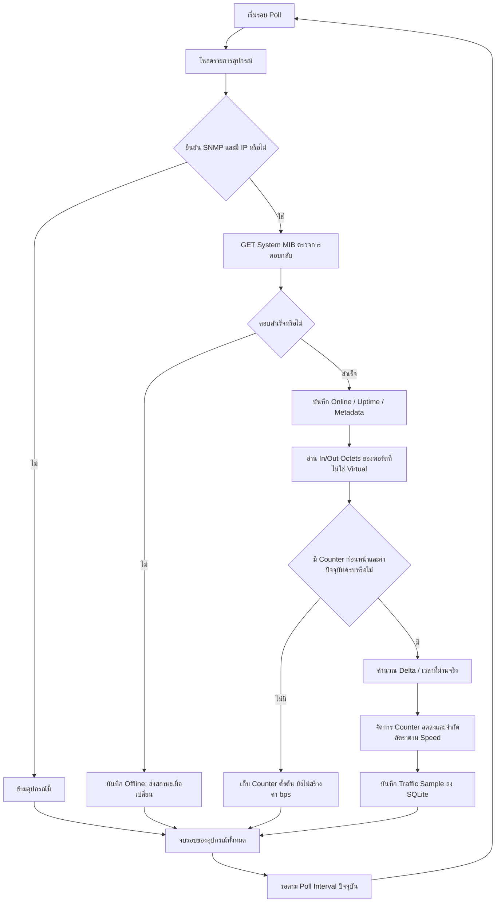

### 6.2 สูตรคำนวณ

```text
Receive bps = (InOctets ปัจจุบัน - InOctets ก่อนหน้า) × 8 / เวลาที่ผ่านไปจริง
Sent bps    = (OutOctets ปัจจุบัน - OutOctets ก่อนหน้า) × 8 / เวลาที่ผ่านไปจริง
```

- `Receive / In` คือข้อมูลที่เข้าพอร์ต **จากมุมมองอุปกรณ์** และ `Sent / Out` คือข้อมูลที่ออกจากพอร์ต
- ใช้ `ifHCInOctets` / `ifHCOutOctets` แบบ 64 บิตก่อน และใช้ Counter 32 บิตเมื่ออุปกรณ์ไม่รองรับ
- Counter ครั้งแรกใช้เป็นฐาน จึงต้องมีการอ่านถัดไปก่อนจะได้ค่า bps
- Cache ของ Counter ก่อนหน้าอยู่ใน Memory; เมื่อเริ่มบริการใหม่ต้องสร้างฐานใหม่
- ช่วงรอถูกนับหลังจบการอ่านทั้งรอบ ระยะระหว่าง Sample จึงอาจมากกว่าค่าตั้งเล็กน้อยตามเวลาตอบ SNMP
- การแบ่ง Bucket ของกราฟไม่ได้เพิ่มความถี่การอ่านจริง เช่น Bucket Live 5 วินาทีไม่ได้หมายความว่า Poll ทุก 5 วินาที

### 6.3 กราฟย้อนหลัง

`get_traffic_history()` รวม Sample ของพอร์ตด้วยค่าเฉลี่ยในแต่ละ Bucket

| ช่วง | ข้อมูลย้อนหลัง | ขนาด Bucket |
| --- | --- | --- |
| Live | 10 นาที | 5 วินาที |
| วัน | 24 ชั่วโมง | 5 นาที |
| สัปดาห์ | 7 วัน | 30 นาที |
| เดือน | 30 วัน | 2 ชั่วโมง |
| ปี | 365 วัน | 1 วัน |

หน้า Traffic เรียกข้อมูลของอุปกรณ์และพอร์ตที่เลือก แล้ว `TrafficCanvas` วาดเส้น In/Out ส่วน `calculateStats()` คำนวณ Current/Min/Max/Average จากจุดข้อมูลที่ได้รับ กราฟเว้นช่องเมื่อข้อมูลหาย ไม่สร้าง Traffic สมมติเพื่อเติมช่วงว่าง

ข้อมูลรายปีจะมีเท่าที่ระบบเคยเก็บจริง การเลือก “ปี” ไม่สามารถเรียกข้อมูลก่อนเริ่ม Monitor ได้

> กราฟรวมบน Dashboard ใช้ `get_aggregate_traffic()` ซึ่งโค้ดปัจจุบันใช้ `SUM` ของ Sample ทั้งหมดใน Bucket มีข้อจำกัดด้านความหมายของอัตรารวมเมื่อหนึ่งพอร์ตมีหลาย Sample ใน Bucket ดูหัวข้อ 16

## 7. การสั่งเปิดและปิด Interface

ระบบส่ง SNMP SET ไปที่ `ifAdminStatus.<ifIndex>` โดย `1 = up` และ `2 = down` หลังส่งจะอ่าน `ifAdminStatus` และ `ifOperStatus` กลับมาเพื่อตรวจผล

```mermaid
sequenceDiagram
    actor User as ผู้ใช้
    participant Web as หน้าอุปกรณ์ / Traffic
    participant API as API
    participant Device as Router / Switch
    participant DB as SQLite
    User->>Web: เลือก Up หรือ Down และยืนยัน
    Web->>API: POST admin-status
    API->>API: ตรวจอุปกรณ์ IP พอร์ต และสถานะที่ขอ
    API->>Device: SNMP SET ifAdminStatus.ifIndex
    alt ส่ง SET สำเร็จ
        API->>Device: GET ifAdminStatus และ ifOperStatus
        Device-->>API: ค่า Admin และ Oper จริง
        alt อ่านกลับสำเร็จและ Admin ตรงคำสั่ง
            API->>DB: อัปเดตสถานะและ Audit Log
            API-->>Web: ผลสำเร็จ + WebSocket PORT_STATUS_CHANGE
        else ยืนยันผลไม่ได้
            API->>DB: Audit Log ล้มเหลว
            API-->>Web: ข้อผิดพลาด; ไม่บันทึกสถานะตามที่คาดเดา
        end
    else ส่ง SET ไม่สำเร็จ
        API->>DB: Audit Log ล้มเหลว
        API-->>Web: ข้อผิดพลาด; ไม่บันทึกสถานะตามที่คาดเดา
    end
```

เงื่อนไขสำคัญ:

- ต้องมี Management IP และเป็นอุปกรณ์ที่ยืนยัน SNMP แล้ว
- Community ต้องมีสิทธิ์ **RW จริง** และอุปกรณ์ต้องอนุญาตเขียน OID นี้
- **Admin Up ไม่รับประกัน Oper Up** หากสายหลุด พอร์ตฝั่งตรงข้ามปิด หรือ Link ยังไม่พร้อม
- คำสั่ง SET และ Audit Log เป็นคนละส่วนกับ Trap; ระบบไม่ได้สร้างเหตุการณ์ `linkUp/linkDown` แทนการรับ Trap
- หากปิดพอร์ตที่ใช้เข้าถึง Management IP อาจทำให้ไม่สามารถส่งคำสั่งเปิดกลับจากเส้นทางเดิมได้

## 8. การรับ SNMP Trap

อุปกรณ์ต้องตั้งปลายทาง Trap เป็น IP ของเครื่องที่รันบริการ และส่งเข้าพอร์ต UDP ที่ระบบเปิดรับจริง การ Poll เห็นสถานะเปลี่ยนอย่างเดียวไม่ทำให้เกิด Trap ในรายการ Events

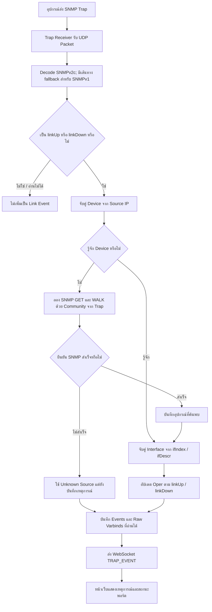

| ประเภท | OID |
| --- | --- |
| `linkDown` | `1.3.6.1.6.3.1.1.5.3` |
| `linkUp` | `1.3.6.1.6.3.1.1.5.4` |

- SNMPv2c Trap อ่าน `ifIndex`, `ifDescr`, Admin/Oper และ Raw Varbinds ที่มีใน Packet
- เส้นทาง SNMPv1 แยก Generic Trap 2/3 แต่ยังไม่อ่าน Varbinds เพื่อระบุพอร์ต จึงมีข้อจำกัดในการจับคู่ Interface
- ปุ่ม Test Trap ส่ง **SNMPv2 Notification จริงผ่าน UDP ไปยัง Receiver บนเครื่องเดียวกัน** ไม่ได้เพิ่มแถว Events โดยตรง
- การปิด Real-time ในเว็บควบคุมการแสดงสด/การเชื่อมต่อของหน้าเว็บ การรับและบันทึก Trap ในบริการยังทำงาน

## 9. Auto Discovery ด้วย CDP และ LLDP

Discovery มี **สองช่องทาง** ที่ให้ข้อมูลต่างกัน

### 9.1 รับเฟรมโดยตรง — Passive Capture

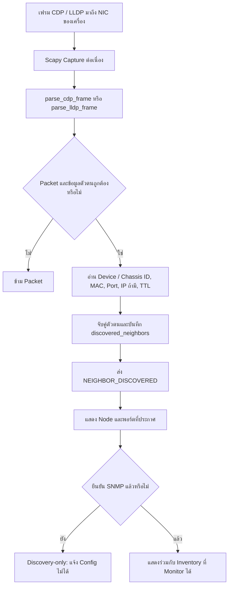

- ไม่ต้องมี Community หรือ IP บนอุปกรณ์เพื่อแยกเฟรมที่รับได้
- **เห็นเฉพาะเฟรมที่มาถึง NIC** ไม่สามารถมองเห็นทุก Node ของ EVE หรืออุปกรณ์หลัง Switch ทุกตัวโดยอัตโนมัติ
- Windows ต้องมี Npcap และสิทธิ์ Capture ที่ใช้งานได้
- เฟรมบอกพอร์ตของอุปกรณ์ที่ประกาศ แต่ไม่ได้บอกการต่อสายทั้งหมดใน EVE จึงอาจเห็น Node โดยยังไม่มีสายระหว่าง Node
- TTL หมดแล้วเก็บรายการ Neighbor ไว้เป็น `offline` ไม่ลบทิ้งทันที

### 9.2 อ่าน Neighbor MIB ผ่าน SNMP และค้นต่อ

ไม่บังคับระบุ Subnet สามารถเริ่มจาก **Seed IP หนึ่งตัว** หรือรายการที่มีอยู่แล้ว ส่วน Subnet ใช้สำหรับค้นหา IP เริ่มต้นเพิ่มเติม

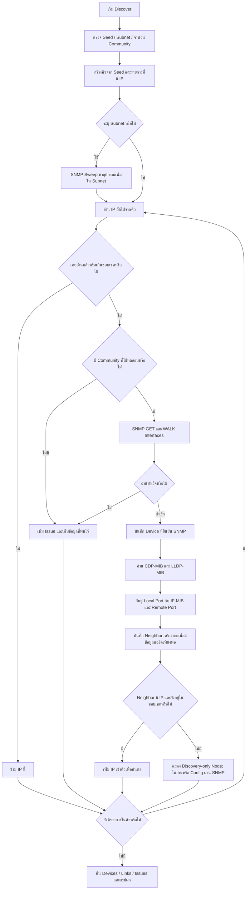

รายละเอียดที่โค้ดรองรับ:

- ค้นต่อแบบ **Breadth-first Search** พร้อมชุด IP ที่เข้าคิว/ตรวจแล้ว ป้องกันวนกลับซ้ำ
- ค่าเริ่มต้นตรวจได้ 64 อุปกรณ์และลึก 8 ระดับ; API จำกัดสูงสุด 256 อุปกรณ์และ 16 ระดับ
- ใช้ Community จากคำขอ หรือจากอุปกรณ์ที่บันทึกไว้ รองรับสูงสุด 8 ค่า
- Subnet ต้องเป็น IPv4 และไม่เกิน 4,096 Addresses ในเส้นทาง Discovery นี้
- CDP ใช้ Local ifIndex; LLDP จับคู่ Local Port ID/Description/MAC กับ IF-MIB ไม่ถือว่า LLDP Port Number เป็น ifIndex ทันที
- Neighbor ไม่มี IP ยังคงแสดง Node และสายได้ **เมื่ออุปกรณ์ที่อ่าน SNMP ได้รายงาน Neighbor และพอร์ตเพียงพอ**
- อ่าน Neighbor Table ครบจะแทนที่ Snapshot ของ Reporter/Protocol นั้น; หากอ่านไม่ครบจะเก็บ Observation เดิมไว้จนหมดอายุ
- งาน Discovery ทำได้ครั้งละหนึ่งงาน; UI อ่านความคืบหน้าจาก Job ID แสดง IP ที่กำลังอ่าน จำนวนที่ตรวจ และ Issues
- Periodic Discovery ค่าเริ่มต้นทุก 60 วินาที แยกจากรอบ Traffic Polling

### เงื่อนไขของ lab

| สถานการณ์ | ผลที่คาดได้จากช่องทางที่มี |
| --- | --- |
| เปิด CDP/LLDP อย่างเดียวและเฟรมมาถึงเครื่อง | พบตัวตนและพอร์ตที่ประกาศได้; ยังไม่มี Traffic/Config ผ่าน SNMP |
| เปิด CDP/LLDP แต่เฟรมไม่มาถึงเครื่อง และไม่มีตัวกลางที่อ่าน SNMP ได้ | ไม่มีข้อมูลเพียงพอให้ค้นพบ Node หลังตัวกลาง |
| Seed มี IP + SNMP RO + Neighbor MIB | อ่าน Neighbor และสร้างสายตามข้อมูลพอร์ตได้ |
| Neighbor ไม่มี IP แต่ Seed รายงานตัวนั้น | แสดง Node/สายแบบ Discovery-only; ไม่ค้นต่อผ่าน SNMP จากตัวนั้น |
| Neighbor มี IP แต่ SNMP ไม่ตอบ | แสดงข้อมูลที่พบและ Issue; ยังอ่านรายละเอียดทั้งหมดไม่ได้ |
| ทุกตัวที่จะค้นต่อมี IP + SNMP RO และเปิด CDP/LLDP บน Link | สามารถไล่ค้นต่อได้ภายในขอบเขตและข้อมูลที่แต่ละอุปกรณ์รายงาน |

## 10. การสร้าง Topology และลดสายซ้ำ

สายมาจาก **Neighbor Observation พร้อม Local Port และ Remote Port** ไม่สร้างสายเพียงเพราะ IP อยู่ใน Subnet เดียวกัน

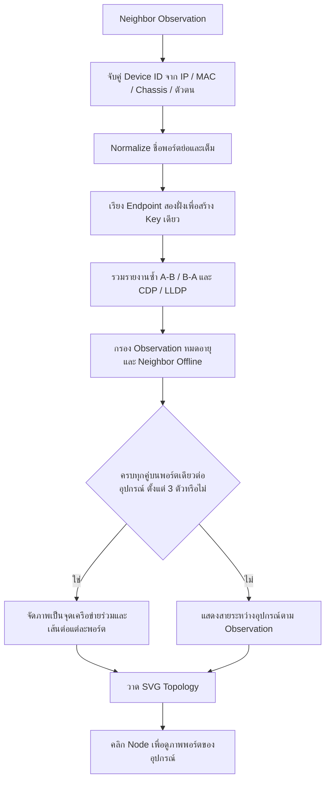

### การระบุตัวตนและป้องกันสายซ้ำ

- ใช้ Management IP, MAC, Chassis ID และ Device Identity ประกอบการจับคู่
- ชื่อทั่วไป เช่น `Switch` หรือ `Router` ที่ไม่มี Strong ID ใช้ขอบเขต Reporter/Local Port ประกอบ ไม่รวมทุกตัวเข้าด้วยกันตามชื่ออย่างเดียว
- ชื่อพอร์ต เช่น `Gi0/1` กับ `GigabitEthernet0/1` ถูก Normalize เพื่อสร้าง Key เดียวกัน
- รายงานสายเดียวกันจากสองฝั่งหรือสอง Protocol ไม่ทำให้วาดสายซ้ำ
- สายที่ใช้พอร์ตคนละคู่ยังเป็นคนละ Link เช่น มีการต่อขนานจริงสองเส้น
- Observation ของสายมี TTL 180 วินาที; รายงานอีกฝั่งที่ยังไม่อ่านใหม่อาจคงอยู่จน Snapshot ใหม่หรือ TTL หมด

### จุด “เครือข่ายร่วม” คืออะไร

เป็นการจัดกลุ่มภาพเมื่อข้อมูล Neighbor แสดงอุปกรณ์ตั้งแต่ 3 ตัวที่เห็นกันครบทุกคู่ และแต่ละอุปกรณ์ใช้พอร์ตเดียวในกลุ่มนั้น เช่น การต่อเข้ากับ Shared Network/Bridge ใน lab

จุดนี้เป็น **ข้อสรุปสำหรับการแสดงภาพจากข้อมูล Neighbor** ไม่ใช่ Switch/Hub ที่ตรวจพบหรืออุปกรณ์ SNMP เพิ่มเติม ระบบไม่ได้อ่าน EVE API เพื่อยืนยันอุปกรณ์ร่วมดังกล่าว ข้อมูลไม่ครบ หรือสามเหลี่ยมที่ใช้คนละพอร์ตจะไม่ถูกจัดกลุ่มด้วยกฎนี้

## 11. การตั้งค่ารอบอ่านข้อมูล

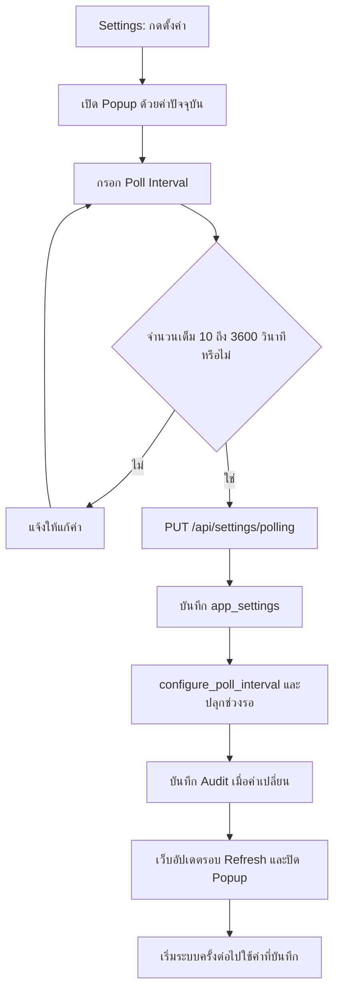

- เป็นค่ากลางของทุกอุปกรณ์ ยังไม่มีค่ารายอุปกรณ์
- ไม่ยกเลิกคำขอ SNMP ที่กำลังอ่าน; ปรับช่วงรอของรอบถัดไป
- หน้าเว็บใช้ค่ารอบเดียวกันสำหรับการ Refresh ข้อมูลที่เกี่ยวข้องกับ Traffic
- Health และ Inventory/Topology ยังมีรอบ Refresh ประมาณ 15 วินาที
- ไม่เปลี่ยนรอบ Periodic Discovery และไม่กระทบ Trap Receiver ที่ฟังต่อเนื่อง

## 12. ฟังก์ชันและโมดูลสำคัญ

### 12.1 บริการ API — [backend/main.py](../backend/main.py)

| ฟังก์ชัน | หน้าที่ |
| --- | --- |
| `lifespan()` | เริ่ม/หยุดฐานข้อมูลและงานเบื้องหลัง |
| `health_check()` | รายงานสถานะบริการ Poller, Trap port, Poll Interval และ Capture |
| `get_polling_settings()` / `update_polling_settings()` | อ่าน/บันทึกรอบ SNMP และใช้ค่าขณะทำงาน |
| `test_device_connection()` | ทดสอบ IP และ System MIB ผ่าน SNMP |
| `create_device()` | ตรวจซ้ำ อ่านพอร์ต และบันทึกอุปกรณ์ |
| `list_devices()` / `get_single_device()` | อ่านรายการหรืออุปกรณ์หนึ่งตัว |
| `update_single_device()` / `remove_device()` | แก้ไขแบบทดสอบใหม่ / ลบอุปกรณ์ |
| `get_device_interfaces()` | คืนพอร์ตที่บันทึกของอุปกรณ์ |
| `set_port_admin_status()` | ตรวจเงื่อนไข ส่ง SET บันทึกผลที่ยืนยันและส่ง WebSocket |
| `get_port_traffic()` / `get_traffic_aggregate()` / `get_latest_traffic_endpoint()` | คืนกราฟพอร์ต กราฟรวม และ Sample ล่าสุด |
| `list_events()` / `list_audit_logs()` | คืนเหตุการณ์ Trap และประวัติการทำงาน |
| `trigger_test_trap()` | ส่ง Test Trap จริงเข้า UDP Receiver |
| `get_topology()` | คืนรายการ Node และ Link ล่าสุด |
| `start_discovery_job()` / `discovery_job_status()` | เริ่มงานและอ่าน Progress/Result |
| `run_discovery_endpoint()` / `network_scan_endpoint()` | เส้นทาง Discovery แบบรอผลเพื่อรองรับการเรียกเดิม |
| `cdp_discovery_status()` / `start_cdp_discovery()` | ตรวจหรือเริ่ม Passive Capture |
| `websocket_events_endpoint()` | เชื่อมต่อ Real-time และตอบ Ping/Pong |

### 12.2 SNMP Engine — [backend/snmp_engine.py](../backend/snmp_engine.py)

| ฟังก์ชัน | หน้าที่ |
| --- | --- |
| `snmp_get_system_info()` | GET `sysDescr`, `sysName`, `sysUpTime` |
| `format_uptime()` | แปลง TimeTicks เป็นวันและเวลา |
| `snmp_walk_interfaces()` | WALK รายการพอร์ต ชื่อ Speed, MAC, Admin/Oper, Errors และ Alias; แยก Virtual Interface |
| `snmp_set_admin_status()` | SET `ifAdminStatus` แล้วตรวจค่ากลับ พร้อมอ่าน Oper |
| `snmp_poll_octets()` | อ่าน Counter In/Out แบบ 64 บิตและ fallback 32 บิต |

### 12.3 Poller — [backend/poller.py](../backend/poller.py)

| ฟังก์ชัน | หน้าที่ |
| --- | --- |
| `run_poller_loop()` | อ่านหลายอุปกรณ์ตามรอบและรองรับการเปลี่ยนช่วงรอ |
| `poll_device_metrics()` | ตรวจ Online/Offline อ่าน Counter คำนวณ bps และบันทึก Sample |
| `configure_poll_interval()` | ตรวจช่วงค่า อัปเดตรอบปัจจุบันและแจ้ง Event ให้ช่วงรอ |
| `get_runtime_poll_interval()` | คืนรอบที่บริการใช้อยู่จริง |

### 12.4 Discovery และ Capture

| โมดูล / ฟังก์ชัน | หน้าที่ |
| --- | --- |
| [discovery.py](../backend/discovery.py): `validate_target()` | ตรวจ Seed IPv4 และขนาด Subnet |
| `discover_network()` | ควบคุมคิวค้นต่อ SNMP, ขอบเขต, Progress และ Issues |
| `read_neighbors()` | อ่าน CDP/LLDP Neighbor และข้อมูล Local Port จาก MIB |
| `resolve_port()` | จับคู่ชื่อพอร์ต Alias หรือ MAC กับ Interface |
| `persist_neighbors()` | บันทึกตัวตนและ Snapshot สายตามความครบของข้อมูล |
| `query_cdp_neighbors()` / `query_lldp_neighbors()` | Helper อ่านชื่อ Neighbor |
| [discovery_jobs.py](../backend/discovery_jobs.py): `DiscoveryJobs.start()` / `_run()` / `get()` | สร้าง Job ID ดำเนินงาน เก็บและอ่านผลใน Memory |
| `DiscoveryJobs.periodic()` / `stop()` | ค้นซ้ำตามรอบ / ยกเลิกงานตอนปิดบริการ |
| [network_scanner.py](../backend/network_scanner.py): `scan_host()` / `scan_network()` | SNMP Probe และ WALK ภายใน Subnet แบบจำกัดจำนวนงานพร้อมกัน |
| [cdp_receiver.py](../backend/cdp_receiver.py): `parse_cdp_frame()` | แยก CDPv1/v2 รวมกรณี VLAN tag และ TLV |
| `CdpCapture.start()` / `_capture()` / `_consume()` / `stop()` / `health()` | จัดการ Thread Capture, Queue, การบันทึกข้อมูล และสถานะ |
| [lldp_receiver.py](../backend/lldp_receiver.py): `parse_lldp_frame()` | ตรวจ LLDP TLV และอ่าน Chassis, Port, TTL, Name และ IPv4 ที่มี |

### 12.5 Trap — [backend/trap_receiver.py](../backend/trap_receiver.py)

| ฟังก์ชัน / Method | หน้าที่ |
| --- | --- |
| `start_trap_listener()` | เปิด UDP Receiver และเลือกพอร์ต fallback |
| `SnmpTrapProtocol.datagram_received()` | รับ Packet และส่งงานประมวลผลแบบ async |
| `SnmpTrapProtocol.parse_trap()` | Decode และคัดเฉพาะ linkUp/linkDown |
| `SnmpTrapProtocol.handle_parsed_trap()` | จับคู่ Device/Port บันทึก Event อัปเดต Oper และส่ง WebSocket |
| `_discover_from_trap()` | ลองยืนยันอุปกรณ์จาก Source IP และ Community ที่อยู่ใน Trap |
| `WebSocketManager.connect()` / `disconnect()` / `broadcast()` | จัดการผู้รับข้อความและตัด Connection ที่ส่งไม่ได้ |

### 12.6 ฐานข้อมูล — [backend/database.py](../backend/database.py)

| กลุ่มฟังก์ชัน | หน้าที่ |
| --- | --- |
| `get_db()` / `init_db()` | เปิด SQLite พร้อม WAL/FK และปรับ Schema เก่า |
| `get_all_devices()` / `get_device()` / `save_device()` / `delete_device()` | อ่าน รวม และจัดการ Inventory กับข้อมูล Neighbor |
| `management_ip()` / `normalize_mac()` / `normalize_port_name()` | ตรวจ IP และปรับรูปแบบข้อมูลที่ใช้จับคู่ |
| `record_discovered_neighbor()` | บันทึก Neighbor, Aliases, พอร์ตที่ประกาศ และ TTL |
| `_match_managed_neighbor()` / `_match_captured_neighbor()` | จับคู่ข้อมูล Neighbor กับ Inventory/ประกาศที่มีหลักฐานประกอบ |
| `_neighbor_device()` | แปลง Neighbor เป็น Device แบบ Discovery-only พร้อมเหตุผลที่ Config ไม่ได้ |
| `replace_topology_observations()` / `get_topology_links()` | แทนที่ Snapshot และคืนสายที่ยังใช้ได้แบบลดรายงานซ้ำ |
| `update_interface_status()` | บันทึกสถานะ Admin/Oper ของพอร์ต |
| `save_traffic_sample()` / `get_traffic_history()` / `get_aggregate_traffic()` / `get_latest_traffic()` | เก็บและ Query Traffic |
| `add_event()` / `get_events()` | เก็บและอ่านเหตุการณ์ Trap |
| `add_audit_log()` / `get_audit_logs()` | เก็บและอ่านประวัติการทำงาน |
| `get_poll_interval()` / `save_poll_interval()` | อ่านและบันทึกรอบ SNMP |

### 12.7 หน้าเว็บ

| โมดูล / Component / ฟังก์ชัน | หน้าที่ |
| --- | --- |
| [App.tsx](../src/App.tsx) | ประกอบ Provider, Navigation, หน้าหลัก และ Popup กลาง |
| [SnmpContext.tsx](../src/context/SnmpContext.tsx): `SnmpProvider` | เก็บ Devices, Events, View, Traffic, Settings และการเชื่อมต่อบริการ |
| `runDiscovery()` | เรียก Discovery Job และรวมผลกับสถานะหน้าเว็บ |
| `setPortAdmin()` | ตรวจข้อจำกัด เปิดยืนยัน และเรียก API ควบคุมพอร์ต |
| [api.ts](../src/services/api.ts): `testConnectionApi()` / `createDeviceApi()` / `updateDeviceApi()` / `deleteDeviceApi()` | ติดต่อ API จัดการอุปกรณ์ |
| `setPortAdminApi()` / `fetchTrafficDataApi()` / `fetchAggregateTrafficApi()` / `fetchLatestTrafficApi()` | ควบคุมพอร์ตและอ่าน Traffic |
| `runDiscoveryApi()` / `connectTrapWebSocket()` / `savePollingSettingsApi()` | อ่าน Progress งานค้นหา รับข้อความสด และบันทึก Settings |
| [useLatestTraffic.ts](../src/hooks/useLatestTraffic.ts): `useLatestTraffic()` | โหลด Traffic ล่าสุดและ Refresh ตาม Poll Interval |
| [deviceManagement.ts](../src/utils/deviceManagement.ts): `configurationWarning()` / `mergeDevices()` | ข้อความ Config ไม่ได้และรวมรายการตาม ID |
| [topologyGraph.ts](../src/utils/topologyGraph.ts): `normalizedPort()` / `topologyLinkKey()` / `uniqueTopologyLinks()` | Normalize พอร์ตและสร้าง Key ลดสายซ้ำ |
| `buildTopologyGraph()` / `segmentPosition()` | สร้างรูปแบบแสดงสายและตำแหน่งจุดเครือข่ายร่วม |
| [TrafficCanvas.tsx](../src/components/common/TrafficCanvas.tsx) | วาดกราฟและเว้นเส้นในช่วงข้อมูลขาด |
| [trafficGenerator.ts](../src/utils/trafficGenerator.ts): `TIME_RANGES` / `calculateStats()` | กำหนดช่วงกราฟและคำนวณสถิติ; ปัจจุบันไฟล์นี้ไม่ได้สร้าง Traffic จำลอง |
| [serial.ts](../src/services/serial.ts): `scanSerial()` / `scanSerialWithPort()` | อ่าน CLI ผ่าน Web Serial เป็นเครื่องมือเสริม |
| [SettingsView.tsx](../src/components/settings/SettingsView.tsx) | แสดงสถานะบริการ Audit และ Popup ตั้งค่ารอบอ่าน |
| [CiscoDeviceIcon.tsx](../src/components/common/CiscoDeviceIcon.tsx) | Symbol Cisco ของอุปกรณ์ในรายการ รายละเอียด และ Topology |

## 13. API และข้อความ Real-time

### 13.1 REST API

| Method | Path | การทำงาน |
| --- | --- | --- |
| GET | `/api/health` | สถานะบริการและรอบอ่านที่ใช้อยู่ |
| GET / PUT | `/api/settings/polling` | อ่าน / บันทึก Poll Interval |
| GET | `/api/devices` | รายการ Inventory รวม Discovery-only |
| POST | `/api/devices/test` | ทดสอบ SNMP |
| POST | `/api/devices` | เพิ่มอุปกรณ์ที่ยืนยัน SNMP |
| GET / PUT / DELETE | `/api/devices/{device_id}` | อ่าน / แก้ไข / ลบอุปกรณ์ |
| GET | `/api/devices/{device_id}/interfaces` | พอร์ตที่บันทึกของอุปกรณ์ |
| POST | `/api/interfaces/{device_id}/{port_name}/admin-status` | สั่ง Up/Down และตรวจผล |
| GET | `/api/interfaces/{device_id}/{port_name}/traffic?range=day` | กราฟพอร์ต; ช่วง `live`, `day`, `week`, `month`, `year` |
| GET | `/api/traffic/aggregate` | Traffic รวมตามช่วงเวลา |
| GET | `/api/traffic/latest` | Sample ล่าสุดแต่ละพอร์ต |
| GET | `/api/events` | Trap Events; รองรับ Filter และ Limit |
| POST | `/api/events/test-trap` | ส่ง Test Trap เข้า Receiver |
| GET | `/api/audit-logs` | Audit ล่าสุด |
| GET | `/api/topology` | Node และ Link |
| POST | `/api/discovery/jobs` | เริ่ม Discovery แล้วคืน Job ID |
| GET | `/api/discovery/jobs/{job_id}` | Progress, Status และ Result |
| POST | `/api/discovery` | Discovery แบบรอผล |
| POST | `/api/network/scan` | ค้น Subnet ผ่าน Discovery |
| GET | `/api/discovery/cdp/status` | สถานะและตัวนับ CDP/LLDP Capture |
| POST | `/api/discovery/cdp/start` | เริ่ม Capture และคืนข้อมูลสถานะ |

ชื่อพอร์ตที่มี `/` ใช้ Route แบบ `{port_name:path}`; ฝั่งเรียกต้อง Encode ชื่อพอร์ตตาม API Service

### 13.2 WebSocket `/ws/events`

| Message type | ข้อมูล / เหตุการณ์ |
| --- | --- |
| `TRAP_EVENT` | Trap ที่รับจริง พร้อมอุปกรณ์ พอร์ต ประเภท และสถานะ Oper |
| `PORT_STATUS_CHANGE` | ค่าพอร์ตที่ยืนยันหลัง SNMP SET |
| `DEVICE_STATUS_CHANGE` | Online/Offline เปลี่ยนจากการ Poll |
| `DEVICE_DISCOVERED` | อุปกรณ์ที่ยืนยัน SNMP จากเส้นทาง Trap Discovery |
| `NEIGHBOR_DISCOVERED` | อุปกรณ์จาก Passive CDP/LLDP |
| `ping` / `pong` | ข้อความรักษาการเชื่อมต่อ |

Traffic History และ Progress Discovery ใช้ REST ไม่ได้ส่งทุก Sample ผ่าน WebSocket

## 14. การจัดเก็บข้อมูล

ไฟล์หลักคือ `backend/snmp_monitor.db` ข้อมูล Monitor อยู่ใน SQLite ส่วนตำแหน่ง Node บน Topology และสถานะช่วยแสดงผลบางส่วนเก็บใน `localStorage` ของเบราว์เซอร์

| ตาราง | ข้อมูล |
| --- | --- |
| `devices` | อุปกรณ์ที่ยืนยัน SNMP, IP, Community, Port, Metadata และสถานะ |
| `interfaces` | พอร์ตและ ifIndex, Admin/Oper, Speed, MAC, Alias, Errors |
| `traffic_samples` | Counter และ bps In/Out พร้อม Timestamp |
| `events` | Trap, Source IP, Device, Port, OID และ Raw Varbinds |
| `audit_logs` | ผู้ดำเนินการ Action, Target, Result และเวลา |
| `discovered_neighbors` | ตัวตนจาก CDP/LLDP, พอร์ตที่ประกาศ, Last seen และ TTL |
| `neighbor_aliases` | IP/MAC/Chassis Aliases สำหรับเชื่อมตัวตน |
| `topology_observations` | Link ที่ Reporter/Protocol รายงาน พร้อมเวลาและ TTL |
| `topology_links` | ตาราง Link เดิม; ข้อมูล CDP/LLDP เก่ามีขั้นตอนย้ายไป Observation |
| `app_settings` | ค่าตั้ง เช่น `poll_interval` |

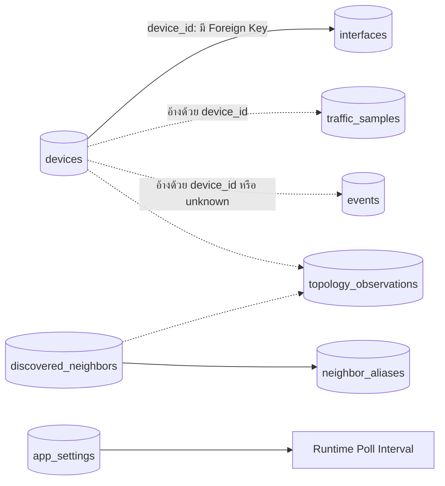

แผนภาพแสดงการอ้างข้อมูลในโปรแกรม ไม่ใช่ทุกเส้นมี Foreign Key ใน SQLite; `interfaces` มี FK ไป `devices` พร้อม Cascade เมื่ออุปกรณ์ถูกลบ

## 15. ความครอบคลุม Requirement

| Requirement | ความสามารถในโค้ด | เงื่อนไข / ขอบเขต |
| --- | --- | --- |
| แสดงผลผ่านเว็บ | รองรับ | เว็บ React และ API |
| เชื่อมทั้ง EVE และอุปกรณ์จริงด้วย IP | รองรับผ่าน SNMP | ต้องเข้าถึง IP และเปิด SNMP; ไม่มี EVE API |
| แสดงภาพพอร์ตทั้งหมดของอุปกรณ์ | แสดงรายการพอร์ตที่อ่านจาก IF-MIB | ต้องอ่าน IF-MIB ได้; Discovery-only รู้เฉพาะพอร์ตที่ประกาศ |
| Up/Down Interface | รองรับ SNMP SET และอ่านค่ากลับ | ต้องมีสิทธิ์ RW และ MIB เขียนได้ |
| กราฟ Sent/Receive ของพอร์ตตามวัน/สัปดาห์/เดือน/ปี | มีช่วงเวลาและการเก็บ Sample | Poller ปัจจุบันข้าม Virtual Interface; มีข้อมูลเท่าที่เก็บจริง |
| Link Up/Down ต้องมาจาก Trap | Receiver รับและบันทึก Trap จริง | อุปกรณ์ต้องส่ง Trap ถึงเครื่อง; SNMPv1 ระบุพอร์ตยังจำกัด |
| Auto Discovery พร้อม Topology และคลิกดูพอร์ต | รองรับ CDP/LLDP + SNMP และ Node ไม่มี IP | ความครบขึ้นกับข้อมูล Neighbor, การเข้าถึง SNMP และขอบเขต Capture |

ตารางนี้เป็นการประเมินความสามารถจากโค้ด ไม่ใช่การรับรองว่าครบทุกอุปกรณ์หรือผ่าน Requirement ทุกกรณีโดยไม่ตั้งค่า lab

## 16. ข้อจำกัดและจุดที่ควรพัฒนาต่อ

1. **SNMP Version:** เส้นทาง GET/WALK/SET ใช้ `CommunityData(community)` เป็น SNMPv2c ตามค่าเริ่มต้น ไม่ได้เลือก Version ตามช่อง `snmp_version`; ยังไม่มี User/Auth/Privacy สำหรับ SNMPv3 จึงไม่ควรถือว่าป้าย Version รับรองการรองรับทุก Version
2. **การตรวจสิทธิ์ RW:** ค่า `rw` ของ Device อาศัยชื่อ Community (`private` หรือมี `rw`) ไม่ใช่การตรวจสิทธิ์จริง การใช้งาน SET สำเร็จขึ้นกับอุปกรณ์และสิทธิ์ที่ตั้งไว้
3. **Virtual Interface:** Poller เลือกเฉพาะพอร์ตที่ไม่ใช่ Virtual ดังนั้น VLAN/Loopback/Tunnel ไม่ได้รับ Traffic Sample จากเส้นทางนี้ แม้ IF-MIB อาจอ่านพบ
4. **สถานะพอร์ตตามรอบ:** Poller หลักอ่านความพร้อมของอุปกรณ์และ Octets ไม่ได้อ่าน Admin/Oper ทุกพอร์ตใหม่ทุกครั้ง ค่าพอร์ตได้จาก WALK ตอนเพิ่ม/แก้ไข/Discovery, SET readback และ Trap หาก Trap สูญหายสถานะอาจยังไม่อัปเดตจนมีการอ่านใหม่
5. **Counter ลดลง:** โค้ดใช้ขนาดค่าเดิม/ใหม่แยก 32-bit wrap จาก Counter reset ยังไม่ได้ใช้ `sysUpTime` หรือ Counter Discontinuity ประกอบ จึงอาจตีความการรีบูตเป็น Wrap และได้ค่าคลาดเคลื่อน
6. **กราฟรวม:** `get_aggregate_traffic()` ใช้ `SUM(in_bps/out_bps)` ทุก Sample ใน Bucket เมื่อหนึ่งพอร์ตมีหลาย Sample จะรวมหลายรอบเข้าด้วยกัน ควรเฉลี่ยต่อพอร์ต/เวลาที่ตรงกันก่อนรวมอัตราของพอร์ต
7. **Retention:** ยังไม่มีนโยบายล้างหรือทำ Rollup ข้อมูลเก่าอัตโนมัติ การ Query เป็น Bucket ไม่ได้ลดจำนวน Sample ที่เก็บในฐานข้อมูล
8. **ตัวตนที่กำกวม:** MAC/Chassis/IP ช่วยลดรายการซ้ำ แต่หากมีเพียงชื่อซ้ำและข้อมูลพอร์ตไม่พอ ไม่สามารถพิสูจน์ได้ว่าเป็นอุปกรณ์เดียวกัน การแสดงแยกยังเป็นไปได้
9. **Topology ไม่ใช่ Wiring จาก EVE:** Neighbor แสดงความสัมพันธ์ที่อุปกรณ์รายงาน Shared Segment เป็นการจัดกลุ่มภาพ ไม่ใช่หลักฐานจำนวนสายหรือ Bridge จาก EVE API
10. **Trap:** รับเฉพาะ Link Up/Down ในเส้นทางนี้ ไม่มีการจัดการ Trap ประเภทอื่นทั่วไปหรือ SNMPv3 Notification; SNMPv1 ยังไม่อ่าน Varbinds เพื่อจับคู่พอร์ต
11. **Job State:** สถานะ Discovery อยู่ใน Memory และเก็บจำกัดประมาณ 20 งาน ไม่ใช่ประวัติงานถาวรข้ามการเริ่มบริการใหม่
12. **การติดตั้งหลายเครื่อง:** URL ของ API/WS ยังเป็น `localhost` ในหน้าเว็บ การเปิดเว็บจากเครื่องอื่นต้องปรับปลายทางบริการและการเข้าถึงเครือข่าย
13. **สิทธิ์ผู้ใช้งาน:** ยังไม่มี Login/Role สำหรับคำสั่ง API; CORS เปิดกว้างและ Community เก็บใน SQLite แบบข้อความ Audit ที่ระบุ `admin` ไม่ได้หมายถึงมีการยืนยันตัวตนแล้ว
14. **Console:** เส้นทาง Serial เป็นเครื่องมือเสริม มีข้อมูลประกอบหน้าจอบางส่วนที่ไม่ได้อ่านจริง และไม่ใช้แทน SNMP Monitoring/Config

## 17. การเปิดโปรแกรมและเอกสารที่เกี่ยวข้อง

**Windows:** ดับเบิลคลิก `run.bat` ที่โฟลเดอร์หลักเพื่อเปิด FastAPI และเว็บในสองหน้าต่าง พร้อมเปิดเบราว์เซอร์เมื่อหน้าเว็บพร้อม ต้องติดตั้ง Python 3 และ Node.js; ไฟล์จะเลือก Virtual Environment ที่มีอยู่ หรือสร้าง `.venv` ใหม่ และติดตั้ง Dependencies ที่ขาดให้อัตโนมัติครั้งแรก หาก API หรือเว็บ NetSmonitor พร้อมอยู่แล้วจะใช้บริการเดิมและเปิดเว็บให้ หากโปรแกรมอื่นใช้พอร์ต 8000 หรือ 5173 จะแจ้งให้หยุดเองก่อน ใช้ `Ctrl+C` ในแต่ละหน้าต่างเพื่อหยุด และใช้ `run.bat check` เพื่อเตรียม Dependencies โดยไม่เปิดบริการ

เมื่อเตรียม Dependencies ของโปรเจกต์แล้ว ใช้ Terminal สองหน้าต่าง

**Terminal 1 — จากโฟลเดอร์หลักโปรเจกต์:**

```powershell
python run_backend.py
```

คำสั่งนี้ใช้ตัวเริ่มบริการที่มีอยู่ในโปรเจกต์ โหลดแอปจาก `backend/main.py` และเปิดพอร์ต 8000 หากต้องการเรียก Uvicorn โดยตรงจากโฟลเดอร์หลัก ใช้คำสั่งทางเลือกนี้แทน:

```powershell
python -m uvicorn main:app --app-dir backend --host 0.0.0.0 --port 8000
```

เลือกใช้เพียงหนึ่งคำสั่งสำหรับบริการ Python ในเวลาเดียวกัน ส่วน `--app-dir backend` ของคำสั่งทางเลือกทำให้ Uvicorn โหลด `main.py` จากโฟลเดอร์ `backend/`

**Terminal 2 — จากโฟลเดอร์หลักโปรเจกต์:**

```powershell
npm run dev
```

เปิด `http://localhost:5173/` และตรวจสถานะบริการใน Settings ก่อนเพิ่มอุปกรณ์

### ตัวเลือก Environment ที่เกี่ยวกับ Discovery

| ตัวแปร | การใช้งาน |
| --- | --- |
| `NETFIX_CDP_ENABLED` | ค่า `false`, `0` หรือ `no` ปิด Passive Capture |
| `NETFIX_CDP_INTERFACES` | ชื่อ/ID NIC ตาม Scapy หลายค่าคั่นด้วย comma; ไม่ระบุจะใช้ NIC ที่พบยกเว้น Loopback |
| `NETFIX_DISCOVERY_INTERVAL` | รอบอ่าน Neighbor อัตโนมัติ; ค่าเริ่มต้น 60 วินาที ขั้นต่ำ 15 วินาที |

ชื่อตัวแปร `NETFIX_*` เป็นชื่อที่โค้ดใช้จริง แม้ชื่อเว็บปัจจุบันเป็น NetSmonitor

### แหล่งอ่านต่อและชุดทดสอบที่มีในโปรเจกต์

- [README](../README.md) — วิธีเชื่อมอุปกรณ์ การเตรียม lab และคำสั่งทดสอบ
- [งาน Passive CDP Discovery](../TASKS_CDP_DISCOVERY.md)
- [งาน Auto Topology](../TASKS_AUTO_TOPOLOGY.md)
- [งาน UI Redesign](../TASKS_UI_REDESIGN.md)
- [Frontend Discovery Tests](../tests/frontend-discovery.test.mjs)
- [Auto Topology Tests](../tests/test_auto_topology.py)
- [CDP Discovery Tests](../tests/test_cdp_discovery.py)

ชุดทดสอบเหล่านี้เป็นแหล่งดูกรณีที่ระบบเตรียมรองรับ เช่น No-IP, TTL, การจับคู่ตัวตน และการลดสายซ้ำ เอกสารฉบับนี้ไม่ได้รันชุดทดสอบหรือเปลี่ยนค่าอุปกรณ์ใน lab เพิ่มเติม
